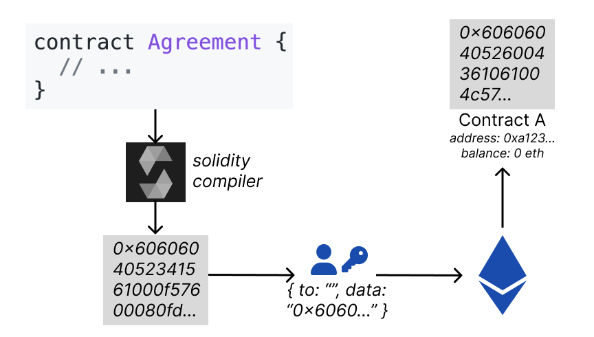
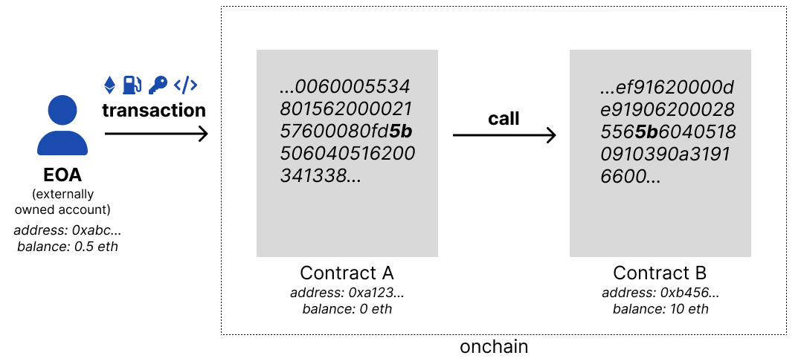

# Smart Contracts: A Blockchain Program

A smart contract is blockchain-deployed code. For example:

```js

function functionName(<paramType> <paramName>) <visibility> <mutability> returns(<returnType>) {
  // code
}

```

---

## Deploying a Contract

1. ⚙️ compile your **solidity** to bytecode
2. ✉️ send a transaction containing the bytecode to an EVM node
3. 🏡 the node calculates an address for your new contract

---

## Contract Deployment



---

| Opcode | Name | Description              | Gas |
| ------ | ---- | ------------------------ | --- |
| `0x00` | STOP | Halts execution          | 0   |
| `0x01` | ADD  | Addition operation       | 3   |
| `0x02` | MUL  | Multiplication operation | 5   |
| `0x03` | SUB  | Subtraction operation    | 3   |

https://ethereum.org/en/developers/docs/evm/opcodes/

---

## Key Takeaways

1. ⚙️ Contracts are compiled to creation bytecode
2. ⛓ The `data` field contains your creation bytecode
3. 📭 The `to` field is left blank to deploy a contract
4. 🏡 Your contract will have an address, balance and runtime bytecode

---

## Transaction Life Cycle



---

## Key Takeaways

1. 🥾 Transactions begin at an EOA
2. ☝️ Transactions occur sequentially
3. ⛽️ Transactions set a gas limit
4. 🎯 Transactions send calldata, targetting a contract method
5. 🌐 Similarly smart contracts can call each other within the one transaction
